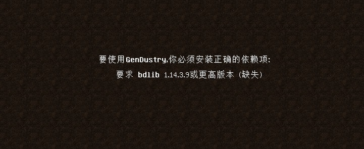

## Forge 崩溃相关

**[通用部分](crash-mod-common.md)讲过的就不再赘述了**

**在寻找崩溃报告前, 先看看你有没有这样的~~土味~~背景:**

要使用xx mod, 你必须安装其依赖项。 要求xxx mod a.b.c版本或更高(缺失)
这时请自行前往[MC百科](https://mcmod.cn)/[Modrinth](https://modrinth.com)和[CurseForge](https://curseforge.com) 搜索其要求的模组, 比如图中的bdlib

### 怎么找崩溃报告

打开你的MC安装目录（一股为.minecraft文件夹，部分整合包的根日录与整合包同名，比如all the mods，但无论名宇有什么不同，它都是mods和saves的所在），找到crash-report文件夹，将内部日期最新（ 即为你最近的一个崩溃报告）的文件，用记事本或者~~notepad+＋~~ Visual Studio Code打开，就可以看到崩溃信息了

## 练习

以下是一个崩溃报告的示例: [点击传送](https://paste.gg/p/anonymous/4682b398e6714cd49a6da3d63f788949)

在***大多数***情况下, 28行之前的 `Coremods are present` 可直接忽略, ~~不要一看到Warning就应激~~

转到第31行, 可以看到`Rendering Item`, 这代表该崩溃和渲染物品有关

接着往下看, 来到第33行, 可以看到抛出了一个[类型转换异常(ClassCastException)](https://php.cn/faq/566710.html)(如果你不知道什么是异常,请先查看[知识补充](../iqboost/%E9%9B%B7%E5%8E%89%E9%A3%8E%E8%A1%8C%E7%9A%84%E7%A7%91%E6%99%AE.md)), 是在将`net.minecraft.item.ItemAir` 转换为 `net.minecraft.item.ItemBlock` 过程中发生的。 ItemAir代表空气, 在MC中, 空格不是什么都没有, 而是由空气物品取代了那个位置。 ItemAir肯定没办法具现化(误)成一个方块物品, 因而会在此处抛出异常

来到34行, 看到一大堆at at at不要慌, 先理解它们到底是什么意思 [详细解释](https://paste.gg/p/anonymous/0554a22179c7461c8d75b3e8cf67aa20)

一般来讲, 看到最上面的at就够了....看到`twillightforest`了没? 相信你一定很熟悉, 这就是著名的暮色森林, 到这你其实已经能够直接删除暮色来解决问题了。

但是, 能不能再抢救一下呢?

从上面的一大堆at可以看出, 错误发生在暮色`ColorHandler`类的第266行(ColorHandler.java:266)

这时我们可以结合[暮色的源代码](https://github.com/TeamTwilight/twilightforest/blob/1.11.2/src/main/java/twilightforest/block/ColorHandler.java#L266)来分析

lambda$init$13里的lambda代表lambda表达式，也就是上面的那个->符号，结台ItemBlock，我们可以看到问题的原因在于
——如果玩家的物品栏什么都没有，那么stack(Itemstack)应该是空的，根本不能从stack获取到Item，还转什么
ItemBlock?
当然，看是一回事，自己动手做又是一回事，绝大多数人连看都看不到这里，如果你不会开发，还是老老实实的向作者发
issue报告问题吧